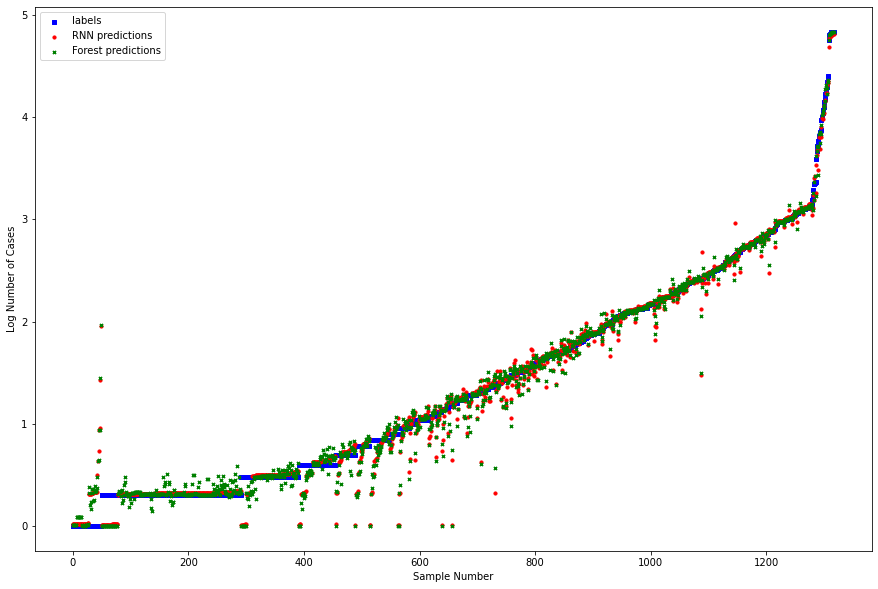

# AI Predicts the Spread of COVID-19
## Analysis done with data available through April 2020
This research project was done collaboratively as part of the "Machine Learning for Virginia" project in Richard Nguyen's Machine Learning class. 
At the start of the COVID outbreak, we decided that it would be an interesting idea to try and predict future cases.

Originally, the data was just formatted as a time series, which meant that there wasn't much training data to work with (there are only ~200 countries and 50 states). So we began by generating more rows of data, by splitting it every 10 days. So our training data end up looking like:  

| cases on day n |  
| -------------- |
| y |
  

| cases on day n - 1 | cases on day n - 2 | ... | cases on day n - 10 |
| ------------------ | ------------------ | --- | ------------------- |
| xn-1 | xn-2 | ... | xn-10 |  

This gave us many more rows of data to train on.  

We then tried to optimize a set of machine learning models, but the best results came from recurrent neural nets, and random forrests.

Below is an image of the model predictions vs the realized values.

